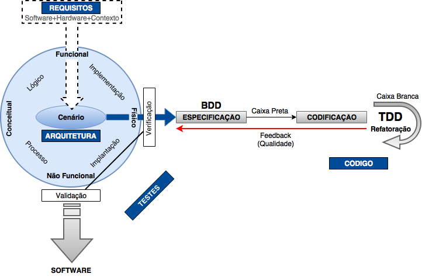

# Introdução

Este livro tem como objetivo complementar nos aspectos teóricos, os recursos da Página e Repositório - no desenvolvimento do aplicativo Citações.

Os temas serão voltados para o ramo Sistema de Computação, principalmente abordando a disciplina de **Arquitetura de Software e Testes** com Algoritmos e Mineração de Dados nas tecnologias _Java_, _Haskell_, _Lisp_, _C_, _Red_, _Emacs_ e _GNU/Linux_.

Os capítulos descrevem as etapas marco de um fluxo de desenvolvimento de _software_, apresentando as principais características encontradas, finalizando com as ferramentas utilizadas e metodologias para estudo.

O _framework_ de desenvolvimento é baseado em: **XP**, **DDD**, **SPD** e **4+1**.

**Página**: [mdssjc.github.io](http://goo.gl/wfgE07 "Página do MDS")

**Repositório**: [github.com/mdssjc](http://goo.gl/FvxXNM "Repositório do MDS")

**[Requisitos](requisitos/README.md)** \| **[Arquitetura](/arquitetura/README.md)** \| **[Testes](testes/README.md)** \| **[Código](/codigo/README.md)** \| **[Ferramentas](/ferramentas/README.md)** \| **[Metodologia Científica](/metodologia-cientifica/README.md)**

---

**Última atualização: 13/03/2017**
