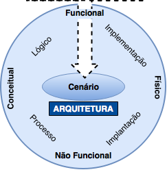

# Arquitetura

A etapa de **Arquitetura** traz a estrutura organizacional de um sistema, incluindo sua decomposição em partes, sua conectividade, seus mecanismos de interação e os princípios e decisões que orientam no desenvolvimento de um sistema.

As três fundamentais etapas são:

* [**Cenário**](cenario.md "Cenário"): Descrevendo o problema.
* [**Análise**](analise.md "Análise"): O que fazer para solucionar o problema?
* [**Projeto**](projeto.md "Projeto"): Como fazer para solucionar o problema?

O guia para etapas são através dos [**Princípios, Padrões e Práticas**](principios-padroes-praticas.md "Princípios, Padrões e Práticas").

Dentre os pontos importantes estão:

* **Etapa Zero**: a etapa/iteração zero é a primeira atividade, na qual utiliza o cenário mais simples (_World_ ou _Walking Skeleton_) e representativo do projeto, assim validando o ambiente de desenvolvimento (IDE, Controle de Versão, Servidores, _Frameworks_, _Rigs_, etc...).
* **Arquiteturas Modernas**: novos estudos de arquiteturas para a representação de _software_, baseadas em variantes da arquitetura _Ports-And-Adapters_, tais como: _Hexagonal_, _Onion_ e _Clean_.
