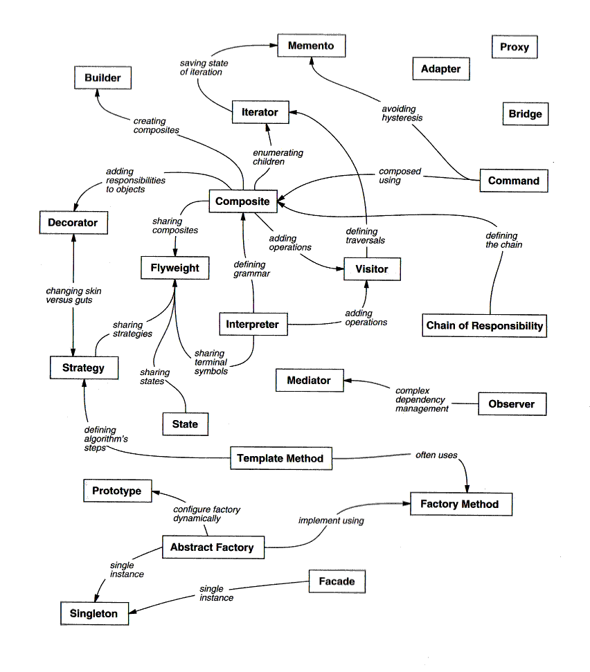

# GoF

O acrônimo GoF - _Gang of Four_ apresentado no livro _Design Patterns_ dos autores _Erich Gamma_,
 _John Vlissides_, _Ralph Jonhson_ e _Richard Helm_ explana um catálogo de 23 genéricas soluções para o desenvolvimento de _software_ no paradigma orientado a objetos.

Os _Design Patterns_ do livro são: "_descrições de objetos e classes comunicantes que precisam ser personalizadas para resolver um problema geral de projeto num contexto particular_".

Os princípios por trás dos padrões estão:

* **Programe para uma interface, não para uma implementação** - _Program to an interface, not to an implementation_: introduzido no livro do GoF, recomenda o uso de abstrações como ponto de acesso entre elementos de programação.
* **Prefira a composição de objeto à herança de classe** - _Favor object composition over class inheritance_: introduzido no livro do GoF, recomenda o uso de composição à herança na construção elementos de programação.

Classificação segundo GoF:

 |            |            |                  | **Propósito**    |                         |
 |------------|------------|------------------|------------------|-------------------------|
 |            |            | **Criação**      | **Estrutural**   | **Comportamento**       |
 |            |            | _Creational_     | _Structural_     | _Behavioral_            |
 |------------|------------|------------------|------------------|-------------------------|
 | **Escopo** | **Classe** | Factory Method   | Adapter (Class)  | Interpreter             |
 | _Scope_    | _Class_    |                  |                  | Template Method         |
 |------------|------------|------------------|------------------|-------------------------|
 |            | **Objeto** | Abstract Factory | Adapter (Object) | Chain of Responsability |
 |            | _Object_   | Builder          | Bridge           | Command                 |
 |            |            | Prototype        | Composite        | Iterator                |
 |            |            | Singleton        | Decorator        | Mediator                |
 |            |            |                  | Facade           | Memento                 |
 |            |            |                  | Flyweight        | Observer                |
 |            |            |                  | Proxy            | State                   |
 |            |            |                  |                  | Strategy                |
 |            |            |                  |                  | Visitor                 |

Classificação segundo _Metsker_:

| **Intenção**        | **Padrões**                                                              |
|---------------------|--------------------------------------------------------------------------|
| 1. Interfaces       | Adapter, Facade, Composite, Bridge                                       |
| 2. Responsabilidade | Singleton, Observer, Mediator, Proxy, Chain of Responsibility, Flyweight |
| 3. Construção       | Builder, Factory Method, Abstract Factory, Prototype, Memento            |
| 4. Operações        | Template Method, State, Strategy, Command, Interpreter                   |
| 5. Extensões        | Decorator, Iterator, Visitor                                             |

Relacionamento entre padrões:

## Padrões

### Criação

#### Abstract Factory

O padrão _Abstract Factory_ prove uma interface para criar uma família de objetos relacionados ou dependentes sem especificar suas classes concretas.

Conhecido como: _Kit_.

Do GoF:
> _Provide an interface for creating families of related or dependent objects without specifying their concrete classes._

#### Builder

O padrão _Builder_ separa a construção de um objeto complexo da sua representação de modo que o mesmo processo de construção possa criar diferentes representações.

Do GoF:
> _Separate the construction of a complex object from its representation so that the same construction process can create different representations._

#### Factory Method

O padrão _Factory Method_ define uma interface para criar um objeto, mas deixa as subclasses decidirem que classe instanciar. O _Factory Method_ permite adiar a instanciação para subclasse.

Conhecido como: _Virtual Constructor_.

Do GoF:
> _Define an interface for creating an object, but let subclasses decide which class to instantiate. Factory Method lets a class defer instantiation to subclasses._

#### Prototype

O padrão _Prototype_ especifica os tipos de objetos a serem criados usando uma instância-protótipo e cria novos objetos pela cópia desse protótipo.

Do GoF:
> _Specify the kinds of objects to create using a prototypical instance, and create new objects by copying this prototype._

#### Singleton

O padrão _Singleton_ garante que uma classe tenha somente uma instância e forneça um ponto global de acesso para a mesma.

Do GoF:
> _Ensure a class only has one instance, and provide a global point of access to it._

### Estrutural

#### Adapter

O padrão _Adapter_ converte a interface de uma classe em outra interface, esperada pelos clientes. O _Adapter_ permite que classes com interfaces incompatíveis trabalhem em conjunto - o que de outra foram seria impossível.

Conhecido como: _Wrapper_.

Do GoF:
> _Convert the interface of a class into another interface clients expect. Adapter lets classes work together that couldn't otherwise because of incompatible interfaces._

#### Bridge

O padrão _Bridge_ desacopla uma abstração da sua implementação, de modo que as duas possam variar independentemente.

Conhecido como: _Handle/Body_.

Do GoF:
> _Decouple an abstraction from its implementation so that the two can vary independently._

#### Composite

O padrão _Composite_ compõe objetos em estruturas de árvore para representarem hierarquias parte-todo. _Composite_ permite aos clientes tratarem de maneira uniforme objetos individuais e composições de objetos.

Do GoF:
> _Compose objects into tree structures to represent part-whole hierarchies. Composite lets clients treat individual objects and compositions of objects uniformly._

#### Decorator

O padrão _Decorator_ anexa dinamicamente responsabilidades adicionais a um objeto. Os _Decorators_ fornecem uma alternativa flexível ao uso de subclasses para extensão de funcionalidades.

Conhecido como: _Wrapper_.

Do GoF:
> _Attach additional responsibilities to an object dynamically. Decorators provide a flexible alternative to subclassing for extending functionality._

#### Facade

O padrão _Facade_ fornece uma interface unificada para um conjunto de interfaces em um subsistema. _Facade_ define uma interface de nível mais alto que torna o subsistema mais fácil de ser usado.

Do GoF:
> _Provide a unified interface to a set of interfaces in a subsystem. Facade defines a higher-level interface that makes the subsystem easier to use._

-------------------------------------------------------------------------------

### Strategy

O padrão _Strategy_ define uma família de algoritmos, encapsula cada uma delas e torná-las intercambiáveis. _Strategy_ permite que o algoritmo varie independentemente dos clientes que o utilizam.

Conhecido como: _Policy_.

Do GoF:
> _Define a family of algorithms, encapsulate each one, and make them interchangeable. Strategy lets the algorithm vary independently from clients that use it._

### Observer

O padrão _Observer_ define uma dependência um-para-muitos entre objetos, de maneira que quando um objeto muda de estado todos os seus dependentes são notificados e atualizados automaticamente.

Conhecido como: _Dependents_, _Publish-Subscribe_.

Do GoF:
> _Define a one-to-many dependency between objects so that when one object changes state, all its dependents are notified and updated automatically._

### Command

O padrão _Command_ encapsula uma solicitação como um objeto, desta forma permitindo parametrizar clientes em diferentes solicitações, enfileira ou faz registro (_log_) de solicitações e suporta operações que podem ser desfeitos.

Conhecido como: _Action_, _Transaction_.

Do GoF:
> _Encapsulate a request as an object, thereby letting you parameterize clients with different requests, queue or log requests, and support undoable operations._

### Template Method

O padrão _Template Method_ define o esqueleto de um algoritmo em uma operação, postergando alguns passos para as subclasses. _Template Method_ permite que subclasses redefinam certos passos de um algoritmo sem mudar a estrutura do mesmo.

Do GoF:
> _Define the skeleton of an algorithm in an operation, deferring some steps to subclasses. Template Method lets subclasses redefine certain steps of an algorithm without changing the algorithm's structure._

### Iterator

O padrão _Iterator_ fornece meios de acessar, sequencialmente, os elementos de um objeto agregado sem expor a sua representação subjacente.

Conhecido como: _Cursor_.

Do GoF:
> _Provide a way to access the elements of an aggregate object sequentially without exposing its underlying representation._

### State

O padrão _State_ permite a um objeto alterar seu comportamento quando o seu estado interno muda. O objeto parecerá ter mudado sua classe.

Conhecido como: _Objects for States_.

Do GoF:
> _Allow an object to alter its behavior when its internal state changes. The object will appear to change its class._

### Proxy

O padrão _Proxy_ fornece um substituto ou marcador da localização de outro objeto para controlar o acesso a esse objeto.

Conhecido como: _Surrogate_.

Do GoF:
> _Provide a surrogate or placeholder for another object to control access to it._

Tipos: _Remote_, _Virtual_, _Protection_, _Firewall_, _Smart Reference_, _Caching_, _Synchronization_, _Complexity Hiding_ e _Copy-On-Write_.
