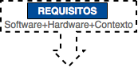
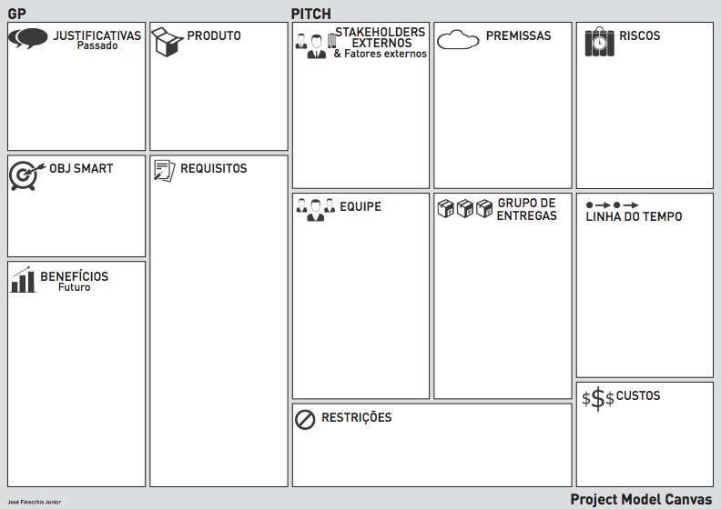

# Requisitos



A etapa de **Requisitos** marca o início de um projeto e determina sua base de avaliação, na qual a equipe de desenvolvimento será exposta aos problemas do cliente, esses são formados pelos requisitos em que definem uma necessidade específica, na qual detalha o que um particular produto ou serviço deve ser ou fazer - etapa fundamental nas disciplinas de Engenharia de Sistemas ou Engenharia de _Software_.

**Requisitos** = _Software_ + _Hardware_ + Contexto

**Constante** = Mudança - _Change_

**Importante regra**: _os requisitos sempre mudam!_

## Fases

As principais fases são:

* **Requisitos do Usuário** (visão - _vision_): apresentação do problema pelo cliente através de descrição e especificação, assim verifica-se a viabilidade para a execução do projeto;
* **Requisitos do Sistema** (característica - _feature_): processo de consolidação/entendimento do problema entre cliente e desenvolvedores, assim define-se o problema proposto; e
* **Modelagem dos Requisitos** (detalhe - _detail_): comunicação com a Arquitetura do _Software_ através da transformação em cenário, assim define-se uma solução para o problema.

## Tipos

Os tipos de requisitos são:

* **Funcional**: descreve as funcionalidades e características necessárias ao sistema;
* **Não Funcional**: descreve as restrições e limites impostas ao sistema.

## Artefatos

Os principais artefatos produzidos durante esta etapa são:

* **Listagem**: itens categorizados em tópicos, conforme a disciplina de cada requisito; ou
* **Descrição**: itens com descrição textual em alto nível para cada requisito.

```
Project MDS,  version 1.0
-------------------------
    Requirements List

1. requirement A
2. requirement B
3. requirement C
#. ...
```

## Contexto

O contexto é um importante componente dos requisitos, pois seu domínio é o ponto inicial na construção de um modelo genérico da arquitetura, assim imergindo no mesmo garante melhores resultados ao projeto - existem diversas técnicas específicas para sua gestão, como por exemplo: o SMART, 5W2H, _Inception Deck_ e o _Project Model Canvas_ - dentre as atividades práticas para garimpar as ideias estão o: _brainstorming_, entrevistas e etc...

### SMART

O que esperar de uma boa ideia:

* **S** (_Specific_): específica, bem definida;
* **M** (_Measurable_): mensurável, quantificada;
* **A** (_Assignable_): alcançável, desafiadora;
* **R** (_Realistic_): relevante para você; e
* **T** (_Time-related_): temporal, que tenha uma prazo.

### 5W2H

O modelo de gerenciamento de ideias _5W2H_ tem como objetivo em responder 7 perguntas:

* **What** (O quê?): o que será feito? [objetivo, ação, etapas, descrição]
* **Why** (Porquê?): por que será feito? [justificativa, motivo, benefício]
* **Who** (Quem?): por quem será feito? [responsável, equipe]
* **When** (Quando?): quando será feito? [tempo, data, prazo, cronograma]
* **Where** (Onde?): onde será feito? [local, departamento]
* **How** (Como?): como será feito? [atividades, método, processo]
* **How Much** (Quanto Custa?): quanto vai custar? [custo, gastos, quantidade]

### Inception Deck

O _Inception Deck_ é um conjunto de 10 questões sobre o quê pensar antes de iniciar um projeto.


### Project Model Canvas

O _Project Model Canvas_ (_PM Canvas_) é uma metodologia de gerenciamento de projetos, na qual emprega características ágil.


